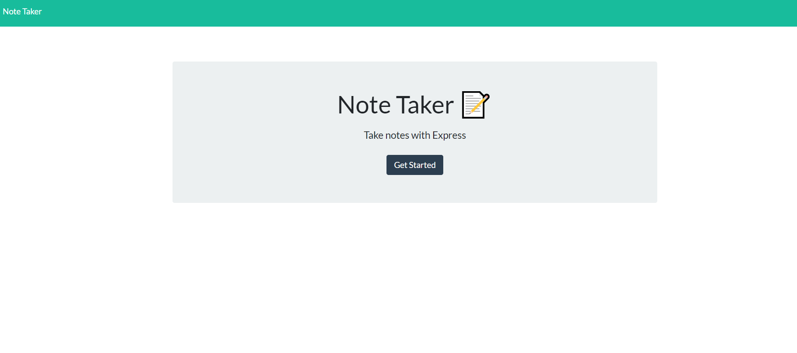
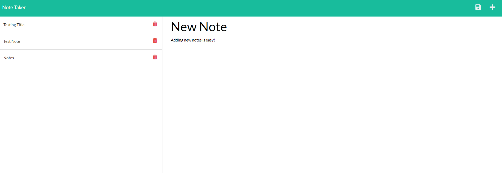
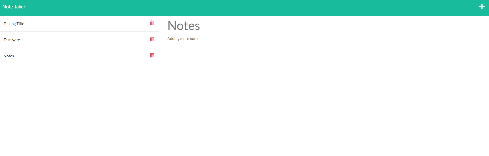

# note-taker [](https://opensource.org/licenses/MIT)

## Table of Contents
* [Description](#description)
* [Installation](#installation)
* [Usage](#usage)
* [License](#license)
* [How to Contribute](#how-to-contribute)
* [Credits](#credits)
* [Contact](#contact)

## Description
A note taking app written with an Express.js server on the back end. This was my first time writing a back-end for an application from scratch. 

## Installation
Navigate to ```./note-taker```

Run the following command from the terminal: 

```npm i```

## Usage
Navigate to ```./note-taker```

Run the following command from the terminal: 

```node server.js```

Screenshots:




Application is deployed at [mels-note-app.herokuapp.com](https://mels-note-app.herokuapp.com/)

## License 
This project is covered under the MIT License: [](https://opensource.org/licenses/MIT)

## How to Contribute
Fork the repository or contact me using the details shown below

## Credits 
Front end was provided by Trilogy Education Services.

## Contact
Please feel free to contact me through GitHub or email, using the following details: 

Email: mel.jack.developer@gmail.com

GitHub: [meljack1](https://github.com/meljack1/)
